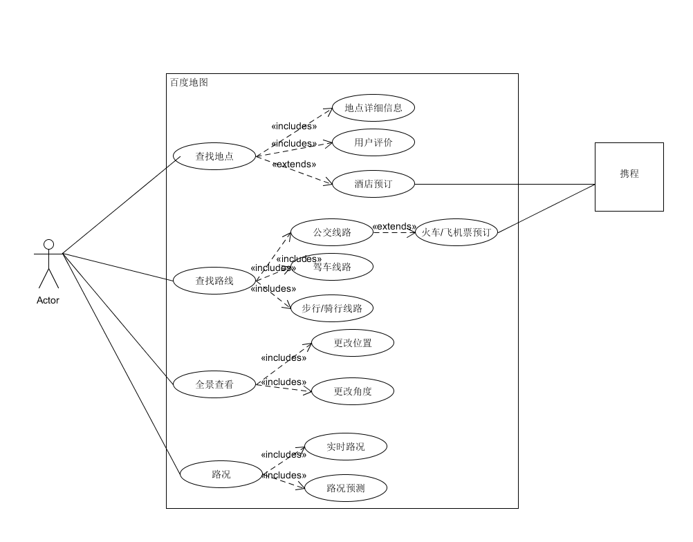
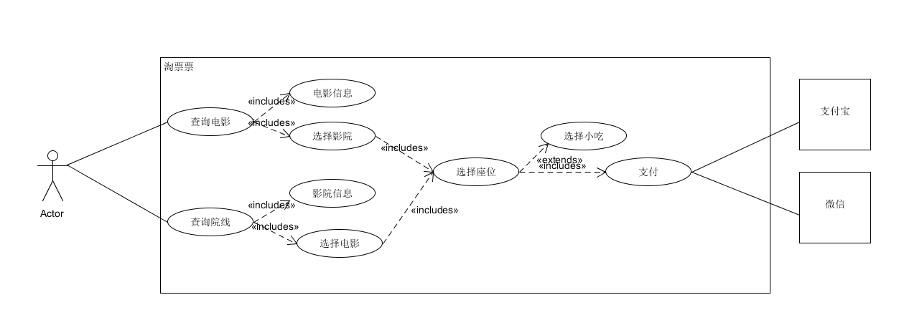

# HW4

## 1. 简答题

### 1. 用例的概念

1. 用例是完全用文本写就，一系列用户与系统交互去完成他们的目标的成功或失败的场景；

### 2. 用例和场景的关系？什么是主场景或 happy path？

场景是一个用户为了完成目标和系统的一系列交互，场景是用例的组成成分。

主场景或happy path是用户与系统主要功能的交互（最常用的功能），直接地实现了用户的目标的场景。

### 3. 用例有哪些形式？

- 简洁形式
  - 一段摘要，通常是一个主场景。
  - 常用在早期的需求分析阶段，为了获得对项目的大体感觉和范围。只需要几分钟就玩完成创建。
- 简便格式
  - 非正式的段落格式。涵盖各种场景的多个段落。
- 完整格式
  - 详细地写出所有的步骤和变化，有一些支持的部分，如成功的先决条件和保障。
  - 在大量用例用简洁形式写就和确认之后，在第一个需求研讨会的时候，一些（10%左右）架构上重要和有很高价值的用例会被详细地重写。

### 4. 对于复杂业务，为什么编制完整用例非常难？

因为对于复杂的业务，使用的场景会非常地多，在没有完成软件实际地观察用户的使用或是接到用户的反馈的时候，很难凭空想象出所有的场景，只能够先编制一些主场景，在上线之后根据观察和用户的反馈不断地丰富用例。

### 5. 什么是用例图？

用例图常常是用例模建模的一部分，它给出了用例和actor的名字，以及他们的关系。这给出了一个很好的系统及其环境的上下文关系图。 

### 6. 用例图的基本符号与元素？

1. actors，用小人表示
2. system，使用一个方框表示
3. use case，在系统方框内部的一个椭圆形表示
4. actor和use case的关系，使用actor到use case的连线表示
5. 外部支持系统，系统方框外部的方框表示

### 7. 用例图的画法与步骤

1. 确定系统的边界
2. 确定系统的参与者
3. 满足主要参与者目标的系统服务
4. 建立参与者与系统服务的关联

### 8. 用例图给利益相关人与开发者的价值有哪些？

1. 用例图是一个很好的上下文关系图
2. 用例图展现了系统的边界，以及解释了系统外部是什么，系统应该被如何使用
3. 用例图能够作为一种沟通的工具，能总结系统及其参与者的行为。 

## 2. 建模练习题（用例模型） 

- 选择2-3个你熟悉的类似业务的在线服务系统（或移动 APP），如定旅馆（携程、去哪儿等）、定电影票、背单词APP等，分别绘制它们用例图。并满足以下要求： 

  - 请使用用户的视角，描述用户目标或系统提供的服务
  - 粒度达到子用例级别，并用 include 和 exclude 关联它们
  - 请用色彩标注出你认为创新（区别于竞争对手的）用例或子用例
  - 尽可能识别外部系统和服务

  

  

### 1. 为什么相似系统的用例图是相似的？

因为要实现相同的功能，有许多东西是绕不开的，这就会有相似的系统服务，系统服务之间相似的关系，以及相似的外部系统，这样就产生了一个相似的用例图。

### 2. 如果是定旅馆业务，请对比 Asg_RH 用例图，简述如何利用不同时代、不同地区产品的用例图，展现、突出创新业务和技术

1. 现代的订旅馆服务可以在地图上直接选择酒店，搜索酒店的系统的子系统增加地图选取
2. 支持的支付方式增加，不仅限于传统的银行卡信用卡，还有新兴的支付宝微信
3. 订的时候不止能看到酒店的信息，还能看到游客对其的历史评论

### 3. 如何利用用例图定位创新思路（业务创新、或技术创新、或商业模式创新）在系统中的作用

创新用例一般出现在extend或者include的子用例中。

### 4. 请使用 SCRUM 方法，选择一个用例图，编制某定旅馆开发的需求（backlog）开发计划表

| ID   | Name        | Imp  | Est  | How to demo                          | Notes |
| ---- | ----------- | ---- | ---- | ------------------------------------ | ----- |
| 1    | 查找地点    | 10   | 3    | 输入地点名字，给出坐标等信息         |       |
| 2    | 查找路线    | 8    | 7    | 给定两个地点，输出所有能够到达的路线 |       |
| 3    | 全景查看    | 3    | 10   | 能够360°查看景点的全景               |       |
| 4    | 路况        | 2    | 8    | 指定道路，查看、预测路况             |       |
| 5    | 酒店预订    | 1    | 5    | 直接跳转携程预订地图上的酒店         |       |
| 6    | 飞机/火车票 | 1    | 5    | 在路线中能跳转携程订购火车票/机票    |       |

### 5. 根据任务4，参考 使用用例点估算软件成本，给出项目用例点的估算

>- 简单用例：1 到 3 个事务，权重=5
>- 一般用例：4 到 7 个事务，权重=10
>- 复杂用例：多于 7 个事务，权重=15

| id   | 名称            | 事务 | 计算 | 评级     |
| ---- | --------------- | ---- | ---- | -------- |
| 1    | 查找地点        | 4    | 9    | 复杂用例 |
| 2    | 查找路线        | 3    | 7    | 复杂用例 |
| 3    | 全景查看        | 2    | 4    | 一般用例 |
| 4    | 路况            | 2    | 4    | 一般用例 |
| 5    | 酒店预订        | 1    | 2    | 简单用例 |
| 6    | 飞机/火车票预订 | 1    | 2    | 简单用例 |

